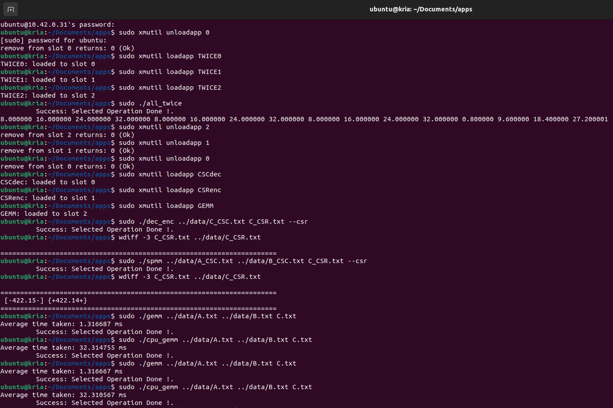
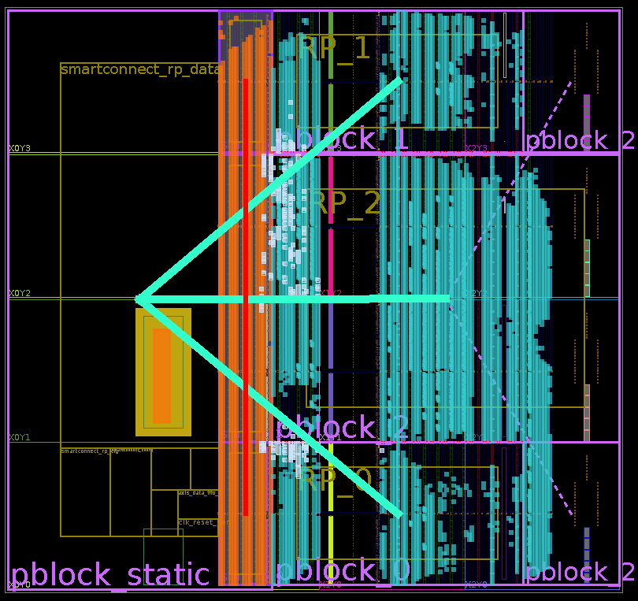
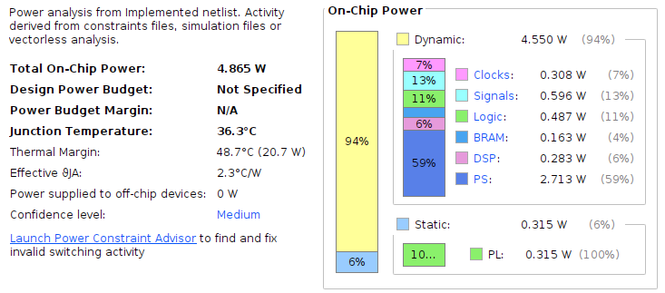
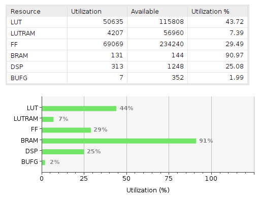

# dfx-3rp-bin

The implemented DFX binaries of 3 Reconfigurable Partitions (RPs) for Sparse Matrix-Matrix Multiplication (SPMM).

Toolchain: Vitis 2022.1, Vivado 2022.1 @ Ubuntu 22.04.5 LTS.

See [this repo](https://github.com/fjtcin/dfx-3rp) for reproduction.

## `dfx-3rp` directory

This directory contains all the generated configuration files. Copy it to KV260 and run `sudo make install`.
Then you can load the reconfigurable modules, and test SPMM on board using [these programs](https://github.com/fjtcin/dfx-3rp/tree/axis/apps).

> In the figure, we first use the `xmutil` command to load three `TWICE` RMs (Reconfigurable Modules), whose function is to double the input stream before outputting it. We then execute the `all_twice` application to test the interconnection between the RMs. This application defines the input of RP_0 as DDR, the output of RP_0 as the input of RP_1, the output of RP_1 as the input of RP_2, and the output of RP_2 as DDR. In other words, the initial input is multiplied by 8 before being output.
>
> Next, we unload the three `TWICE` RMs and load the `CSCdec` (CSC matrix decompression RM), `CSRenc` (CSR matrix compression RM), and `GEMM` (dense matrix multiplication RM). The `dec_enc` application connects the output of `CSCdec` to the input of `CSRenc`, converting the matrix format from CSC to CSR. The `spmm` application performs sparse matrix multiplication, taking two CSC matrices as input and outputting a CSR matrix. The `wdiff` tool is used to compare the FPGA output with the ground truth. The `gemm` and `cpu_gemm` applications respectively test the execution time of dense matrix multiplication on the FPGA and the CPU.
>
> For more information on `xmutil`, check out the [official tutorial](https://xilinx.github.io/kria-apps-docs/dfx/build/html/docs/run_application_on_target.html).

Files contained:

* opendfx_shell_wrapper.bit: base file
* opendfx_shell_wrapper.dtsi: [generated from %.xsa](https://github.com/fjtcin/dfx-3rp/blob/axis/create_new_rm/README.md)
* shell.json: [Documentation](https://github.com/Xilinx/dfx-mgr/blob/master/README.md#shelljson)
* static files: Makefile, template.bif
* RM files:
    * accel.json
    * opendfx_shell_i_RP_\*.bit
    * opendfx_shell_i_RP_\*.dtsi

## `ip_repo` directory

This directory contains all the compiled IPs for SPMM. The HLS source code can be found [here](https://github.com/fjtcin/dfx-3rp/tree/axis/hls). We need these IPs to generate configuration files.

## Implementation Results

We consider the decompression of a COO matrix, the compression of a COO matrix, and dense matrix multiplication as a single integrated process. The implementation results on an FPGA are shown in the first figure. The power consumption and resource utilization are shown in the second and third figures, respectively.

As can be seen, to support a 128×128 single-precision floating-point matrix, we have consumed nearly all of the on-board BRAM. A larger matrix size would be impossible to implement on this KV260 development board. It can be said that all on-board resources have been utilized efficiently. If the block size of the tiled systolic array is increased, the RP will not be able to operate at a frequency of 250 MHz. This is because a larger systolic array would occupy a higher proportion of resources such as LUTs and DSPs, to the extent that Vivado's routing would be unable to meet the timing requirements.
